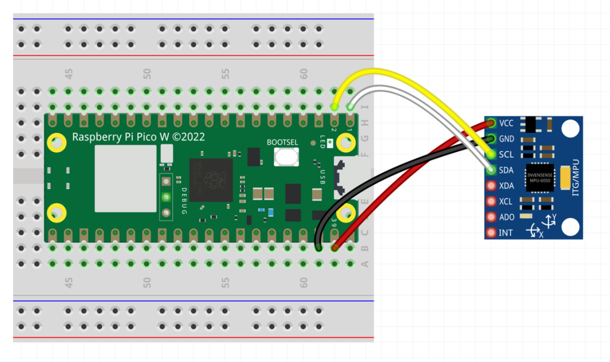

# Sump Pump Vibration Monitor using Raspberry Pi Pico W

This project uses a Raspberry Pi Pico W to monitor the vibration status of a sump pump. The vibration data is collected using an MPU6050 accelerometer and sent to an MQTT broker when a significant vibration is detected.

## Components

- Raspberry Pi Pico W
- MPU6050 Accelerometer
- MQTT Broker (already set up)
- Connecting wires

## Overview

The Raspberry Pi Pico W reads data from the MPU6050 accelerometer, calculates the magnitude of the acceleration vectors, and detects significant changes to identify vibrations. When a vibration is detected, the Pico W sends a message to the MQTT broker.



## Setup Instructions

### Hardware Connections

1. **Connect the MPU6050 to the Raspberry Pi Pico W:**
    - VCC to 3.3V (Pin 36)
    - GND to GND (Pin 38)
    - SCL to I2C0 SCL (GP0, Pin 1)
    - SDA to I2C0 SDA (GP1, Pin 2)

### Software Setup

1. **MicroPython and Library Installation:**

    Ensure you have MicroPython installed on your Pico W. If not, follow the [MicroPython installation guide](https://micropython.org/download/rp2-pico-w/).

    Install the required libraries:
    - `mpu6050.py` (for MPU6050 interaction)
    - `umqtt.simple` (for MQTT communication)

2. **Code Upload:**

    Upload the `mpu6050.py` library to your Raspberry Pi Pico W.

3. **Main Script:**

    Create a new script with the following content:

    ```python
    import math
    import time
    from machine import Pin, I2C
    from mpu6050 import MPU6050
    import network
    from umqtt.simple import MQTTClient

    # Wi-Fi credentials
    SSID = "your_wifi_ssid"
    PASSWORD = "your_wifi_password"

    # MQTT broker details
    MQTT_BROKER = "10.0.0.0"
    MQTT_PORT = 1883
    MQTT_TOPIC = "vibration"

    # Connect to Wi-Fi
    def connect_to_wifi(ssid, password):
        wlan = network.WLAN(network.STA_IF)
        wlan.active(True)
        wlan.connect(ssid, password)
        
        while not wlan.isconnected():
            print('Connecting to Wi-Fi...')
            time.sleep(1)
        
        print('Connected to Wi-Fi:', wlan.ifconfig())

    # Initialize I2C and MPU6050
    i2c = I2C(0, scl=Pin(2), sda=Pin(1), freq=400000)
    mpu = MPU6050(i2c, addr=0x68)

    # Parameters for vibration detection
    threshold = 0.5  # Adjust based on your sensitivity needs
    previous_magnitude = 0

    # Connect to Wi-Fi
    connect_to_wifi(SSID, PASSWORD)

    # Initialize MQTT client
    client = MQTTClient("pico_client", MQTT_BROKER, port=MQTT_PORT)

    # Connect to the MQTT broker
    client.connect()
    print('Connected to MQTT Broker')

    def get_magnitude(accel):
        return math.sqrt(accel['x']**2 + accel['y']**2 + accel['z']**2)

    while True:
        # Get accelerometer data
        accel = mpu.get_accel_data()
        
        # Calculate magnitude of acceleration
        current_magnitude = get_magnitude(accel)
        
        # Detect significant change
        if abs(current_magnitude - previous_magnitude) > threshold:
            print("Vibration detected!")
            print("Magnitude: {:.2f}".format(current_magnitude))
            
            # Send MQTT message
            message = "Vibration detected with magnitude: {:.2f}".format(current_magnitude)
            client.publish(MQTT_TOPIC, message)
            print("MQTT message sent")

        # Update previous magnitude
        previous_magnitude = current_magnitude
        
        # Delay for next sample
        time.sleep(0.01)  # Sampling rate of 100 Hz
    ```

    Replace `your_wifi_ssid` and `your_wifi_password` with your Wi-Fi credentials.

4. **Running the Script:**

    Upload and run the script on your Raspberry Pi Pico W. The script will monitor the vibration and send MQTT messages to the broker when vibrations are detected.

## Conclusion

With this setup, you can effectively monitor the status of your sump pump by detecting vibrations and sending alerts via MQTT. This can help in preemptively identifying issues with the pump.

## Image


